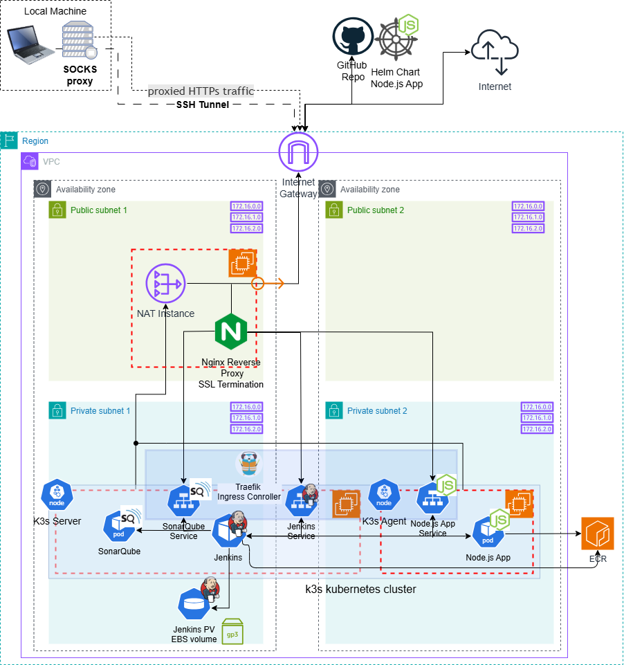
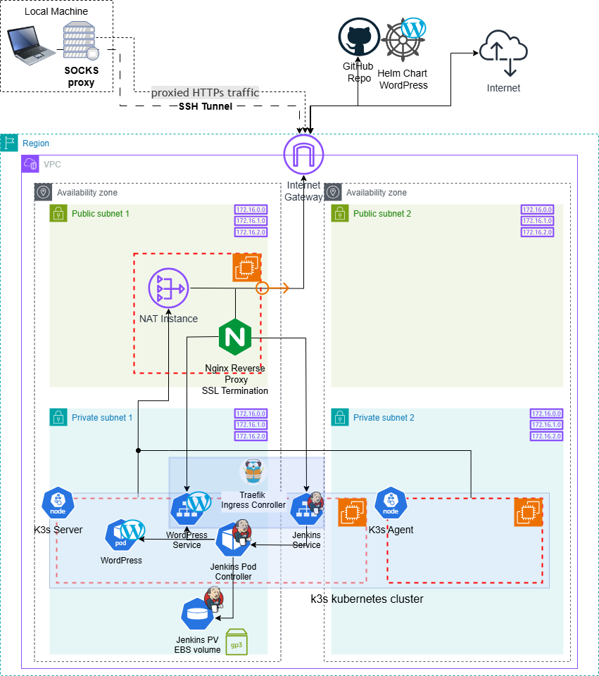

## RS School AWS DevOps Course - App

**Project Structure:**

```
├── nodejs-app
│   ├── helm-chart/         <- Helm Chart for Node.js app
│   ├── src/                <- App source files with tests
│   └── Dockerfile          <- Dockerfile
├── .gitignore
└── Jenkinsfile             <- Jenkins Pipeline definition
```

<details>
<summary><bold>Task 6 - Application Deployment via Jenkins Pipeline</bold></summary>

- Jenkins pipeline configured with [Kubernetes](https://plugins.jenkins.io/kubernetes/) plugin for application deployment including:
  - Application build
  - Unit test execution with coverage
  - Check with [SonarQube Scanner](https://plugins.jenkins.io/sonar/) plugin with Quality Gate (QG)
  - Docker image building and pushing to ECR (manual trigger)
  - Application deployment to K8s cluster with Helm
- Notification system is set up to alert on pipeline failures or successes (AWS SES)
- [SonarQube server is installed with helm](https://github.com/IlyaKozak/rsschool-devops-course-config/blob/main/k3s_server_config.tf#L193-L201) and integrated with Jenkins:
  - Diagram: 
  - SonarQube steps:
    - Create Token for Jenkins: My Account ➤ Security ➤ Generate Tokens ➤ Global Analysis Token (No expiration) ➤ `jenkins`
    - Set up project: Projects ➤ Add project ➤ Create a Local Project ➤ Project Name / Project Key / Branch ➤ Use the Global Setting
    - Set up webhook for Jenkins: Project Settings ➤ Webhooks ➤ Create ➤ Name / URL: `http[s]://<jenkins-server>/sonarqube-webhook/`
  - Jenkins steps:
    - Create `secret text` credentials: Jenkin Credentials ➤ `sonarqube-token`

For more details please see PR: https://github.com/IlyaKozak/rsschool-aws-devops-app/pull/2

</details>

<hr />

**Application Deployment Diagram:**  


<details>
<summary><bold>Task 5 - Simple Application Deployment with Helm</bold></summary>

- Helm chart for WordPress app is created
- WordPress Helm chart deployed to k3s kubernetes cluster via Jenkins CI/CD Pipeline
- WordPress app is accessible via Internet ➤ Nginx reverse proxy ➤ Traefik ingress conroller ➤ Wordpress service in private subnet

For more details please see PR: https://github.com/IlyaKozak/rsschool-aws-devops-app/pull/1

<hr />

**Helm Chart Deploy Diagram:**  


</details>

### Infractructure

Infrastructure configuration provided in this repo (IaC) **https://github.com/IlyaKozak/rsschool-devops-course-infra**

### Configuration

Configuration (k3s kubernetes cluster + Jenkins CI/CD setup) provided in this repo **https://github.com/IlyaKozak/rsschool-devops-course-config**

**Usage:**

Push code (Source code / Helm Chart) to this repo it will be automatically deployed via Jenkins CI/CD Pipeline defined in Jenkinsfile.
GitHub Actions webhook is set up in this repo to trigger Jenkins CI/CD Pipeline with Jenkins [Github](https://plugins.jenkins.io/github/) plugin - `$JENKINS_BASE_URL/github-webhook/`
